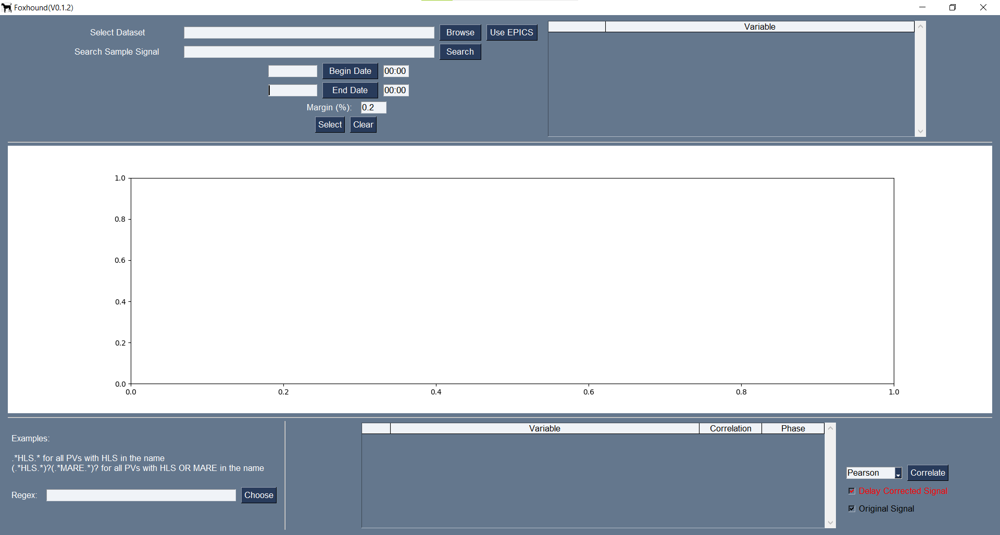

# Foxhound

This has the main goal of automating the process of finding correlations among many variables in a dataset and one main variable.

# Como usar

\* Por enquanto o executável funciona somente para windows 10 (veersão para Linux sendo testada ainda). 
Primeiramente, basta baixar e extrair o arquivo 'Foxhound_Windows.zip' em Releases. Para abrir o aplicativo, basta executar o arquivo Foxhound.exe, presente na pasta Foxhound/ extraida (para linux, o arquivo Foxhound_Linux pode ser executado diretamente). Com isso, a seguinte tela será aberta:  
  
O programa permite o uso de um dataset próprio ou das variáveis presentes no EPICS.

## EPICS

### Escolhendo o sinal principal
Para usar sinais do EPICS, primeiramente certifique-se de que a VPN está conectada. Na sequência, basta clicar no botão 'Use EPICS' e o programa se conectará e listará as variáveis EPICS. Para facilitar a busca pelas variáveis desejadas, basta digitar alguma parte de seu nome na caixa 'Search Sample Signal' e clicar em 'Search'. Assim que a variável de interesse for encontrada, basta clicar nela na lista para selecioná-la e seus dados mais recentes aparecerão no gráfico.

### Escolhendo um intervalo temporal
Com uma variável selecionada, podemos agora definir o intervá-lo temporal de interesse. Para isso, clicando em 'Begin Date' e 'End Date' um calendário será aberto para escolher as datas de início e fim desejadas, e nas caixas de texto ao lado podemos escolher os horários (é importante manter a formatação do horário como HH:MM). O valor de margem também pode ser escolhido na caixa 'Margin'. Esse valor será usado durante o cálculo da correlação e corresponde ao delay máximo buscado, sendo dado como uma porcentagem do intervalo escolhido para variável principal. Com isso, se escolhemos um valor de 0.2 para a margem, por exemplo, os sinais correlacionados podem possuir um delay de 20% para mais ou para menos em comparação ao sinal principal. Vale ressaltar que, quanto maior a margem, maior o tempo que levará para o cálculo das correlações. Quando esses valores estiverem decididos, basta clicar em 'Select' e o gráfico será atualizado para o intervalo definido. Isso pode ser repetido quantas vezes for necessário para encontrar o intervalo exato desejado. O intervalo pode ser escolhido pelo gráfico também, clicando com o botão esquerdo para marcar o ponto de início e com o direito para marcar o ponto final (é necessário clicar em 'Select' após a escolha dos intervalos nesse caso também).

### Escolhendo sinais que serão correlacionados
Com um sinal principal e um intervalo temporal escolhidos, agora iremos escolher os sinais com os quais a correlação será realizada. Para isso, na caixa 'Regex' devem ser digitadas as palavras a serem buscadas nos nomes das PVs separadas por um espaço. Com isso, serão selecionadas todas as PVs contendo ao menos uma das palavras indicada. Caso deseje uma busca mais específica, o marcador & entre duas palavras indica que está se buscando apenas as PVs cujos nomes contem ambas as palavras. Assim, para buscar as variáveis com HLS e MARE no nome, bastaria digitar 'HLS MARE' (sem as aspas). Caso fosse desejado buscar apenas as PVs HLS com Level-Mon, além das de MARE, se digitaria 'HLS&Level-Mon MARE'.

### Correlacionando
Depois de ter os sinais todos escolhidos, basta clicar em 'Correlate' para realizar a correlação. Isso pode levar um tempo significativo dependendo do número de variáveis envolvidas e das margens usadas. Quando a correlação é finalizada, uma lista em ordem decrescente de correlação aparecerá, indicando o coeficiente de Pearson da correlação entre as variáveis e sua fase. Clicando em um sinal nessa lista o mostrará no gráfico em conjunto com o sinal principal. A checkbox 'Delay Corrected Signal:' é usada para optar mostrar o sinal com a fase corrigida e a checkbox 'Original Signal' é usada para mostrar o sinal original, sem essa correção. Ao menos uma dessas duas opções precisa ser selecionada. É importante ressaltar que ela não atualiza o gráfico que está aparecendo na tela atualmente, é necessário selecioná-lo novamente para corrigir/descorrigir sua fase.

## Dataset próprio

Também é possível utilizar um dataset próprio ao invés do EPICS. Para isso, basta clicar em 'Browse' e selecionar o arquivo contendo os sinais de interesse. Esse arquivo precisa seguir alguns padrões listados abaixo:
* Estar no formato .csv
* Possuir uma coluna 'datetime' contendo os tempos de amostragem de cada amostra no formato 'dd.mm.aa hh:mm'
* Cada outra coluna corresponde a um sinal, sendo seu primeiro valor o seu nome  
  Um exemplo de dataset seguindo esse padrão pode ser visto na pasta TestData. De resto, o programa funciona de forma semelhante ao caso com as variáveis EPICS, com a excessão de que não é necessário especificar um regex para escolher os sinais com o qual a correlação será feita, pois, no momento, ela será feita com todos os outros sinais do dataset.

## Possíveis Erros

### Erro ao abrir o dataset
Pode significar que o dataset não segue o formato específicado, ou que nenhum dataset foi selecionado.

### Erro ao inicializar EPICS
Pode significar que a VPN não está conectada.

### Erro na seleção do tempo
Pode significar que o tempo foi selecionado antes de um sinal principal ter sido escolhido.

### Erro na contagem de variáveis
Pode significar que a expressão regular digitada possui erros ou caracteres inválidos.

### Erro na correlação
Pode significar que nenhum sinal principal foi escolhido ou que o intervalo de tempo não foi selecionado.
